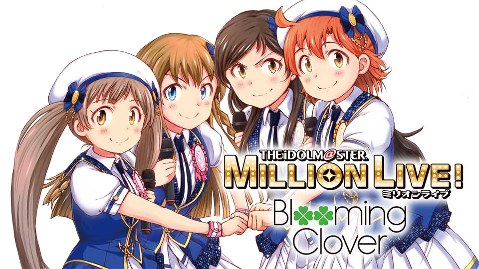

======================================================================
MILLION **R\@G**
======================================================================

ミリオンライブ！とRAGの話

:Event: 【拡大版】アニメから得た学びを発表会
:Presented: 2024/07/20 nikkie

5月ぶりですね
--------------------------------------------------

.. raw:: html

    <iframe width="800" height="480" src="https://ftnext.github.io/2024-slides/engineers-anime/sing-a-bit-of-harmony.html#/1"
        title="『アイの歌声を聴かせて』をきっかけに考え始めた幸せ"></iframe>

お前、誰よ（自己紹介）
======================================================================

* nikkie ／ :fab:`github` `@ftnext <https://github.com/ftnext>`__ ／ `ブログ <https://nikkie-ftnext.hatenablog.com/>`__ 連続610日突破
* Pythonとアニメが好き。`詳細な自己紹介記事 <https://nikkie-ftnext.hatenablog.com/entry/self-introduction-as-anime-fan-202405>`__ もどうぞ
* *副業で* エンジニア 9年目（2016〜）。AI・機械学習

本業は **仕掛け人** 🏃‍♂️
--------------------------------------------------

* 765プロ所属 にっP
* `ミリシタ <https://millionlive-theaterdays.idolmaster-official.jp/>`__：VE5WQ24R
* `エミリー・スチュアートちゃん <https://millionlive-theaterdays.idolmaster-official.jp/idol/emily/>`__、かわいいかわいい（`怪文書 <https://nikkie-ftnext.hatenablog.com/entry/happy-birthday-emily-chang-2024>`__）

THE iDOLM\@STER
======================================================================

ちょっとでも知ってる方〜🙋‍♂️

エンジニアニメとアイマス
--------------------------------------------------

* にしこりさぶろ〜さん 「二次元アイドルから得た代理体験で職業エンジニアとしてのマインドセットを育てる」（`公開版 <https://speakerdeck.com/subroh0508/zi-ji-xiao-li-gan-woer-ci-yuan-aidoruzuo-pin-karade-nagarashe-hui-ren-tositenocheng-chang-wochao-jia-su-saseru>`__）
* nikkie `ポチットップス差し入れ <https://x.com/ftnext/status/1787812181742170513>`__

ブランドたくさん、アニメもたくさん
--------------------------------------------------

* THE iDOLM\@STER (765PRO ALLSTARS)
* シンデレラガールズ
* SideM
* シャイニーカラーズ（*本日ポテチ差し入れ*）
* 学園アイドルマスター
* ヴイアライブ

今回話すのは **ミリアニ**
--------------------------------------------------

* ミリオンライブ！のアニメ
* 2023年10月放送（Amazon Prime Videoなどで `配信してます <https://millionlive-anime.idolmaster-official.jp/onair/>`__！）
* （完走してなくても）見たよって方？🙋‍♂️

ミリオンライブ！
======================================================================

* **グリー** のゲームからスタート（通称グリマス）
* 後継のシアターデイズ（＝ミリシタ）が稼働中（7周年！）
* 2023年がブランド **10周年**。ライブツアーにアニメ
* nikkieは 2014年 グリマス -> (断絶) -> 2023年 ミリアニで復帰

プロモーション映像（**GREE** ロゴ❤️）🏃‍♂️
--------------------------------------------------

.. raw:: html

    <iframe width="560" height="315" src="https://www.youtube-nocookie.com/embed/puqZhQnzUQw?si=jk2YKfS-goWFnjhd" title="YouTube video player" frameborder="0" allow="accelerometer; autoplay; clipboard-write; encrypted-media; gyroscope; picture-in-picture; web-share" referrerpolicy="strict-origin-when-cross-origin" allowfullscreen></iframe>

.. https://x.com/uutan1108/status/1804508196394160339

3️⃣9️⃣
--------------------------------------------------

* アイドルは、39人 (MILLIONSTARS) + 13人 (ALLSTARS)
* Thank you（ありがとう）がキーワードの1つ（だと思ってます）
* ひいい、箱推しになっちゃう

.. アイナナミリアニ異文化交流

私の、ミリアニ怪文書シリーズ
--------------------------------------------------

* `静香ちゃんの孤城（アイドルマスター ミリオンライブ！ アニメ2話感想） <https://nikkie-ftnext.hatenablog.com/entry/million-live-anime-story-2-shizuka-s-solitary-castle>`__
* `「今できないことがあっても大丈夫」 雪歩のセリフがめっちゃ刺さったのです （アイドルマスター ミリオンライブ！ アニメ9話感想） <https://nikkie-ftnext.hatenablog.com/entry/million-live-anime-story-9-we-can-change-to-do-it>`__

`北沢志保さん <https://millionlive-anime.idolmaster-official.jp/character/shiho/>`__
====================================================================================================

.. image:: ../_static/engineers-anime/shiho-san.png

志保さん
--------------------------------------------------

* このLTの主演
* 14歳（中2）
* 演じるのは雨宮天さん

    情熱を胸に秘め、仕事に真摯に向き合うクールビューティー。（アニメサイトより）

ミリアニ6話
--------------------------------------------------

.. image:: ../_static/engineers-anime/milliani-story06_08-1.jpg

https://millionlive-anime.idolmaster-official.jp/#story

「お礼なんていいわよ」
--------------------------------------------------

* 迷いを相談し助言をもらったと思った `静香 <https://millionlive-anime.idolmaster-official.jp/character/shizuka/>`__ からの「ありがとう」に対して
* 「そんなつもりで言ったんじゃないし」とも

噛みつきがち？
--------------------------------------------------

* 他人に対して **冷たい** 印象を受けた
* ソフトスキルが低め？

劇場版「もう時間がないんです！」
--------------------------------------------------

* 2014年 `輝きの向こう側へ <https://www.idolmaster-anime.jp/>`__ （通称ムビマス）
* ALLSTARS 13人 + MILLIONSTARSから7人(/37)
* *狂犬沢志保* さんなどと呼ばれる

志保さんの見え方が変わったんです！！
======================================================================

ネタバレがないように伏せてがんばります

**補完** された情報
--------------------------------------------------

* ミリシタのメモリアルコミュ
* コミカライズ Blooming Clover

メモリアルコミュ視聴後
--------------------------------------------------

彼女がアイドルになった理由は[禁則事項]だから

.. raw:: html

    <blockquote class="twitter-tweet" data-lang="ja" data-align="center" data-dnt="true">
<a href="https://twitter.com/hashtag/%E3%83%9F%E3%83%AA%E3%82%B7%E3%82%BF?src=hash&amp;ref_src=twsrc%5Etfw">#ミリシタ</a> コミュがよくできてますね  北沢志保さん、ううう😭  これムビマスの「もう時間がないんです！」とかめっちゃ印象変わってくる、うう😭
&mdash; nikkie / にっきー 技書博 け-04 Python型ヒント本 (@ftnext) <a href="https://twitter.com/ftnext/status/1799469737640071604?ref_src=twsrc%5Etfw">2024年6月8日</a></blockquote> 

.. _Blooming Clover: https://comic-walker.com/detail/KC_002256_S?episodeType=first

`Blooming Clover`_
--------------------------------------------------

`Blooming Clover`_
--------------------------------------------------

.. raw:: html

    <blockquote class="twitter-tweet" data-lang="ja" data-align="center" data-dnt="true">
12話、心中を思うと、とてもつらい😭😭<a href="https://twitter.com/hashtag/%E3%83%9F%E3%83%AA%E3%82%B7%E3%82%BF?src=hash&amp;ref_src=twsrc%5Etfw">#ミリシタ</a> の今回のイベントのカード、このあたりの話数からってことなのかな😭😭  アイドルマスター ミリオンライブ！ Blooming Clover 第12話　なんで / 漫画：稲山覚也 原作：バンダイナムコエンターテインメント <a href="https://t.co/jXG1iMguxz">https://t.co/jXG1iMguxz</a> <a href="https://twitter.com/hashtag/%E3%83%8B%E3%82%B3%E3%83%8B%E3%82%B3%E6%BC%AB%E7%94%BB?src=hash&amp;ref_src=twsrc%5Etfw">#ニコニコ漫画</a>
&mdash; nikkie / にっきー 技書博 け-04 Python型ヒント本 (@ftnext) <a href="https://twitter.com/ftnext/status/1796816034428838314?ref_src=twsrc%5Etfw">2024年6月1日</a></blockquote>    

「志保さん。。ううう。。😭😭😭」
--------------------------------------------------

.. raw:: html

    <blockquote class="twitter-tweet" data-lang="ja" data-align="center" data-dnt="true">
<a href="https://twitter.com/hashtag/%E3%83%9F%E3%83%AA%E3%82%A2%E3%83%8B%E3%83%8D%E3%82%BF%E3%83%90%E3%83%AC%E6%84%9F%E6%83%B3?src=hash&amp;ref_src=twsrc%5Etfw">#ミリアニネタバレ感想</a> 6話志保さん「不誠実か、人のことなんて言えないのにね」 Clover Daysやミリシタコミュ見たことで色々想起されて印象が全然違う。泣いた😭 <a href="https://t.co/lOoknUDTzE">https://t.co/lOoknUDTzE</a>
&mdash; nikkie / にっきー 技書博 け-04 Python型ヒント本 (@ftnext) <a href="https://twitter.com/ftnext/status/1804399559713739116?ref_src=twsrc%5Etfw">2024年6月22日</a></blockquote>

iDOL GRAND PRIX（アイグラ）が来るぞ！🏃‍♂️
--------------------------------------------------

* それは `7/1(月)の7周年配信 <https://idolmaster-official.jp/news/01_11662>`__ で公開された
* アイドル1人1人にフィーチャーしたモード。例として志保さん！ 畳み掛ける既存コミュダイジェスト😭
* `『ミリシタ』に“アケマス”が実装！？ <https://www.inside-games.jp/article/2024/07/02/157021.html>`__

技術的な学び：RAGと同様
======================================================================

もう時間がないので、正確さより分かりやすさを優先しています

参考：拙ブログ `ミリシタを楽しむ私の身に起きた"RAG" <https://nikkie-ftnext.hatenablog.com/entry/opinion-enjoy-million-live-like-llm-rag>`__

大規模言語モデル（LLM）
--------------------------------------------------

* ChatGPTたちのこと
* 文章の **次の単語を予測** できるように、Webにあるテキスト（ある時点）を一読した
* 「日本の首都は」「東京」と続きが作れる（特別な訓練を受けたので会話もできる）

Retrieval Augmented Generation
--------------------------------------------------

* LLMには知らない情報がある（例：最近のこと、Webにない社内のこと。一読できていない）
* 幻覚（ハルシネーション）：正しくないことを言ってしまう
* 対処するために、 **参考情報も渡してそれを参照** させる（正しくないことは言わなくなる）：RAG

nikkieの身に起きた"RAG"
--------------------------------------------------

* 志保さんのセリフは変わっていない
* 志保さんについて **参照できる情報が増加** した（コミュやコミカライズ）
* 参照した情報によってもたらされる感動😭

別観点で：『`他者と働く <https://publishing.newspicks.com/books/9784910063010>`__』
====================================================================================================

*「わかりあえなさ」から始める組織論*

わかりあえなさ
--------------------------------------------------

* 例：クラウドサービスを導入したいが、別部署に反対されている
* 立場によって解釈の枠組み（≒一般常識）が異なる
* 解釈の枠組みの溝に **対話で橋をかける**

相手（志保さん）の世界の見方を知ったんだ！
--------------------------------------------------

* コミュやコミカライズから、 **志保さんの世界の見方** の一端を理解した
* 「お礼なんていいわよ」「もう時間がないんです！」、どういう見方をして言っているのか分かったために泣ける

まとめ：MILLION R\@G
======================================================================

* 北沢志保さんを例に、**背景情報** を知ったことで **同じセリフが全く別印象** になった事例を紹介
* 大規模言語モデルのRAGっぽい
* 彼女の世界の見方の一端を知ったんだなあ（『他者と働く』）

同じ情報の意味が変わる体験、好きかも
--------------------------------------------------

* 同様の事象として思い出したのは『白い砂のアクアトープ』
* `『白い砂のアクアトープ』の16話「傷だらけの君にエールを」がめっちゃよいのです😭😭😭（ネタバレあり） <https://nikkie-ftnext.hatenablog.com/entry/aquatope-anime-chapter16-awesome-she-is-cinderella>`__
* `期間限定 全話無料配信中です <https://x.com/aquatope_anime/status/1810237391145238828>`__

ご清聴ありがとうございました
--------------------------------------------------

.. raw:: html

    <iframe style="border-radius:12px" src="https://open.spotify.com/embed/track/1u4OlClvfSusqtWsi5mxlJ?utm_source=generator" width="100%" height="352" frameBorder="0" allowfullscreen="" allow="autoplay; clipboard-write; encrypted-media; fullscreen; picture-in-picture" loading="lazy"></iframe>

Appendix
========

拙ブログ `LangChainのRetrievalQAを使い文脈をプロンプトに含めることで、ChatGPTとアニメについておしゃべりしてみる（ムビマス篇） <https://nikkie-ftnext.hatenablog.com/entry/talk-with-chatgpt-about-idol-master-movie-by-langchain>`__

RAGを使わないイメージ
--------------------------------------------------

.. code:: txt

    Human: もう時間がないんですか

LLMはうまく答えられない（どういう状況で時間がないのか分からないため）

RAGのイメージ
--------------------------------------------------

.. code:: txt

    System: Use the following pieces of context to answer the users question.
    If you don't know the answer, just say that you don't know, don't try to make up an answer.
    ----------------
    響「うんうん。まだまだ自分ほどじゃないけどな」

    志保「もう時間が無いんです！　今進める人間だけでも進まないと、みんなダメになりますよ！？」

    奈緒「それは今の可奈にはあかんて」

    響「ふふーん、なんくるないさー！」
    Human: もう時間がないんですか

LLM「はい、志保さんが言っている通り、時間がない状況のようですね。」

EOF
===
