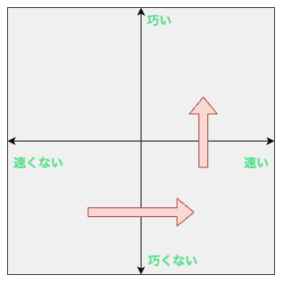
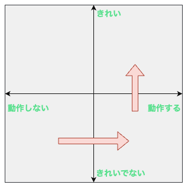

:ogp_title: 2024年で印象的な学び：SHIROBAKOのあのセリフ
:ogp_event_name: engineers-anime
:ogp_slide_name: shirobako-speed-and-technique
:ogp_description: 2024/12 アニメから得た学びを発表会
:ogp_image_name: engineers-anime-dec

======================================================================
2024年で印象的な学び：SHIROBAKOのあのセリフ
======================================================================

2024年で印象的な学び：SHIROBAKOのあのセリフ
======================================================================

:Event: アニメから得た学びを発表会
:Presented: 2024/12/27 nikkie

SHIROBAKOのあのセリフ
======================================================================

    | 速く描くには巧くなる
    | 巧く描くにはいっぱい描く
    | いっぱい描くには速く描く

7話 杉江さん

お前、誰よ（自己紹介）
======================================================================

* nikkie（にっきー）
* Pythonとアニメが好き
* `アドカレ：『白い砂のアクアトープ』に学ぶ、叶わなかった夢との向き合い方 <https://nikkie-ftnext.hatenablog.com/entry/aquatope-anime-broken-dreams-and-future>`__
* 今期『アオのハコ』めっっっっちゃよい（**雛様** あああ。**千夏先輩** うあああ）

.. _厳しい1on1: https://x.com/pauli_agile/status/1806334941254586749

きっかけ🏃‍♂️： `厳しい1on1`_ 系アニメかな
--------------------------------------------------

.. raw:: html

    <blockquote class="twitter-tweet" data-lang="ja" data-align="center" data-dnt="true">
毎日１on１してほしい。僕の上司になってください。 <a href="https://t.co/Iy5nRcdSBf">pic.twitter.com/Iy5nRcdSBf</a>
&mdash; うーたん (@uutan1108) <a href="https://twitter.com/uutan1108/status/1841493777233408239?ref_src=twsrc%5Etfw">2024年10月2日</a></blockquote> 

.. _SHIROBAKO: http://shirobako-anime.com/

`SHIROBAKO`_ （今日は青じゃなくて白！）
======================================================================

* **アニメ業界** お仕事モノ（P.A.WORKS お仕事シリーズ 第2作）
* シロバコとは（↔️販売用パッケージ）

    制作者が最初に手にする事が出来る成果物（`ストーリー <http://shirobako-anime.com/story/index.html>`__ より）

アニメ業界の **群像劇**
--------------------------------------------------

* キャラクターいっぱい http://shirobako-anime.com/character.html
* 中心は **5人の夢追う女の子**
* 夢：高校時代にアニメーション同好会で作ったアニメ（神仏混淆 七福神）を、アニメ業界で5人で作る

ITエンジニア、SHIROBAKO大好き説🤗
--------------------------------------------------

* SHIROBAKO Advent Calendar （`2022 <https://adventar.org/calendars/7483>`__ に一覧）
* IMO：SHIROBAKO × エンジニア = **こにふぁーさん**
* 過去のエンジニアニメでも

10月 エンジニアニメ in 関西 🏃‍♂️
--------------------------------------------------

.. raw:: html

    <iframe class="speakerdeck-iframe" style="border: 0px; background: rgba(0, 0, 0, 0.1) padding-box; margin: 0px; padding: 0px; border-radius: 6px; box-shadow: rgba(0, 0, 0, 0.2) 0px 5px 40px; width: 100%; height: auto; aspect-ratio: 560 / 315;" frameborder="0" src="https://speakerdeck.com/player/36a4c5f74f2647f99ff6ea7e0c7e5c8b" title="「ばん・さく・つき・たー！」にならないためにSHIROBAKOから 学んだこと" allowfullscreen="true" data-ratio="1.7777777777777777"></iframe>

ほか、`5月の東京開催 <https://togetter.com/li/2364695?page=7>`__ でも

夢追う5人 (1/2)
--------------------------------------------------

:制作進行: 宮森あおい（おいちゃん、みゃ〜もり）
:原画: **安原絵麻** （「*絵麻たそ〜*」）
:声優: 坂木しずか（ずかちゃん）

夢追う5人 (2/2)
--------------------------------------------------

:CG: 藤堂美沙（みーちゃん）
:脚本家: 今井みどり（りーちゃん）
:原画（もう1回！）: **安原絵麻** （👈本LTの主役）

ここで重要な情報です🏃‍♂️
--------------------------------------------------

.. raw:: html

    <blockquote class="twitter-tweet" data-lang="ja" data-align="center" data-dnt="true">
10/1に京都、10/2に東京で開催します！  アニメSHIROBAKOだと今井みどりが好きです。  アニメから得た学びを発表会を京都で開催します｜うーたん <a href="https://twitter.com/uutan1108?ref_src=twsrc%5Etfw">@uutan1108</a> <a href="https://twitter.com/hashtag/note?src=hash&amp;ref_src=twsrc%5Etfw">#note</a> <a href="https://t.co/xCpE1rpM3v">https://t.co/xCpE1rpM3v</a> <a href="https://twitter.com/hashtag/%E3%82%A8%E3%83%B3%E3%82%B8%E3%83%8B%E3%82%A2%E3%83%8B%E3%83%A1?src=hash&amp;ref_src=twsrc%5Etfw">#エンジニアニメ</a>
&mdash; うーたん (@uutan1108) <a href="https://twitter.com/uutan1108/status/1838637687563260391?ref_src=twsrc%5Etfw">September 24, 2024</a></blockquote>

脱線：夢追う5人以外は **モデルがいます** 🏃‍♂️
--------------------------------------------------

.. raw:: html

    <blockquote class="twitter-tweet" data-lang="ja" data-align="center" data-dnt="true">
SHIROBAKOの男性キャラの年齢や体型が様々なのは、実際にモデルがいて、その方々に沿ったキャラ造形にしているからです。  ちなみに女性にもかなりモデルの人物がいますし、 女性キャラクターの年齢層は10代〜40代以上とかなり幅があります。  あまりにも浅い考察ですね。 <a href="https://t.co/hTJX8JCK5p">https://t.co/hTJX8JCK5p</a> <a href="https://t.co/UfyoIOa2cN">pic.twitter.com/UfyoIOa2cN</a>
&mdash; 知念実希人【公式】 (@MIKITO_777) <a href="https://twitter.com/MIKITO_777/status/1477650095508455425?ref_src=twsrc%5Etfw">2022年1月2日</a></blockquote>

あのセリフ：速く描くには巧くなる
======================================================================

    | 巧く描くにはいっぱい描く
    | いっぱい描くには速く描く

7話 ネコでリテイク（期間限定公開！）
--------------------------------------------------

    巧くなろうと丁寧に描くと、量が描けない。だが早く描こうとすると巧く描けない（`7話 <http://shirobako-anime.com/story/07.html>`__）

.. raw:: html

    <iframe width="560" height="315" src="https://www.youtube-nocookie.com/embed/p3bNBVznK7w?si=BMJolwyH2ApOAU1D&amp;start=672" title="YouTube video player" frameborder="0" allow="accelerometer; autoplay; clipboard-write; encrypted-media; gyroscope; picture-in-picture; web-share" referrerpolicy="strict-origin-when-cross-origin" allowfullscreen></iframe>

えくそだすっ!原画に関わる
--------------------------------------------------

:総作画監督: 小笠原さん
:総作画監督補佐: 井口さん
:作画監督: 瀬川さん
:関わってない: **杉江さん** （絵麻たその隣席のおじいちゃん）

こちらの方々
--------------------------------------------------

http://shirobako-anime.com/character.html から作成

ネコが思うように描けない絵麻たそに
--------------------------------------------------

* 隣の席の杉江さんからの **助言**

    速く描くには巧くなる 巧く描くにはいっぱい描く いっぱい描くには速く描く

* ⚠️なお後の話（12話）で奥さん曰く「いつも言葉が少ないか多い」

だが、ちょっと待ってくれよぉ〜
======================================================================

* 絵麻たその質問「巧くなれば速く描けるようになるんじゃないんですか？」
* 杉江さん「速く描くには巧くなる (略)」
* **10年間、私よく分かってなかった** んですよね

私の理解：禅問答？
--------------------------------------------------

* 速く描くためには「巧く描く」
* 巧く描くためには「いっぱい描く」
* いっぱい描くためには「**速く描く**」（無限ループ！！🐓🥚🐓🥚）

堂々巡りなんですが...
--------------------------------------------------

* 杉江さん「速く描くためには、 **速く描きなさい**」ってこと？
* こっちはその速く描く方法ってのが知りてぇんだよおおおおお！！！！（`このミーム <https://togetter.com/li/2194895>`__）
* 見落としていた「*技術とスピードは実は全く別の問題でね*」（後述）

SHIROBAKOにおける解決：8話
======================================================================

.. raw:: html

    <iframe width="560" height="315" src="https://www.youtube-nocookie.com/embed/cuLOWvJNWm0?si=vO1t0OBrWaBZEbTU&amp;start=1008" title="YouTube video player" frameborder="0" allow="accelerometer; autoplay; clipboard-write; encrypted-media; gyroscope; picture-in-picture; web-share" referrerpolicy="strict-origin-when-cross-origin" allowfullscreen></iframe>

散歩に出た井口さんと絵麻たそ
--------------------------------------------------

* 井口さんは総作監補（めちゃ絵が巧い人）
* 絵麻たそ突破口「**真似していい**」
* なお散歩のセッティングは杉江さんの采配あり

8話の井口さん
--------------------------------------------------

    （※*過去の自分が*）巧かったとすれば真似が巧かったんだよ

    学ぶっていうのは真似ぶって言うじゃん？

技術とスピードは別の問題
--------------------------------------------------

* 技術（巧さ）は真似して獲得できる
* このとき、**速く描けるといっぱい真似でき** て巧くなりやすい
* いっぱい真似して巧くなったら、巧くかつ速く描けるってことか！💡

原画も **チーム** なんだなあ（感想）
--------------------------------------------------

* 原画マンは一人でモクモク（個）だと思ってました
* 絵麻たそ、全然人に頼らない（過去のnikkieさん重なりポイント）
* 杉江さんや井口さんが気にかけてくれてる。**周りに相談を促している** （EMじゃん！）

10話も見てくれ！（サムネの表情よ😭）
--------------------------------------------------

リテイクした作画監督から絵麻たそに

.. raw:: html

    <iframe width="560" height="315" src="https://www.youtube-nocookie.com/embed/Eh5BhB8Otg0?si=nDR-GVUattrpJxgr&amp;start=1090" title="YouTube video player" frameborder="0" allow="accelerometer; autoplay; clipboard-write; encrypted-media; gyroscope; picture-in-picture; web-share" referrerpolicy="strict-origin-when-cross-origin" allowfullscreen></iframe>

量は質に転化する
======================================================================

速く描けるといっぱい真似できて巧くなりやすい

YAPC::Hakodate 2024 キーノート
--------------------------------------------------

.. raw:: html

    <iframe class="speakerdeck-iframe" style="border: 0px; background: rgba(0, 0, 0, 0.1) padding-box; margin: 0px; padding: 0px; border-radius: 6px; box-shadow: rgba(0, 0, 0, 0.2) 0px 5px 40px; width: 100%; height: auto; aspect-ratio: 560 / 315;" frameborder="0" src="https://speakerdeck.com/player/3053ec81efd94a39aa294a4913207ae1?slide=41" title="Develop to Survive - YAPC::Hakodate 2024 Keynote" allowfullscreen="true" data-ratio="1.7777777777777777"></iframe>

アーカイブ出たらみんなぜひ見てくれよな！

速くて巧いへ（原画・プログラミング）
--------------------------------------------------

テスト駆動開発じゃね？
======================================================================

もしかして、 **ベクトルの共通点**

ケント・ベック曰く
--------------------------------------------------

    目指すのは、動作するきれいなコードだ

    最初に「動作する」に取り組み、その後で「きれいな」に取り組む。

『`テスト駆動開発 <https://www.ohmsha.co.jp/book/9784274217883/>`__』

動作するきれいなコードへ
--------------------------------------------------

まとめ🌯 2024年で印象的な学び：SHIROBAKOのあのセリフ
======================================================================

    速く描くには巧くなる 巧く描くにはいっぱい描く いっぱい描くには速く描く

* 巧さと速さは別。**速さ+真似** で効果的に巧くなれる戦略（量が質に転化する）

ご清聴ありがとうございました
--------------------------------------------------

.. raw:: html

    <iframe class="speakerdeck-iframe" style="border: 0px; background: rgba(0, 0, 0, 0.1) padding-box; margin: 0px; padding: 0px; border-radius: 6px; box-shadow: rgba(0, 0, 0, 0.2) 0px 5px 40px; width: 100%; height: auto; aspect-ratio: 560 / 315;" frameborder="0" src="https://speakerdeck.com/player/0a7a3906caca4a2fa72ff42217c1be25?slide=23" title="はてな技術部紹介 2015（公開版） / Hatena Technical Division Orientation 2015 (Public Edition)" allowfullscreen="true" data-ratio="1.7777777777777777"></iframe>

Appendix
======================================================================

お前、誰よ（補足）
--------------------------------------------------

* 毎日 `ブログ <https://nikkie-ftnext.hatenablog.com/>`__ を書いてます。連続 **770** 日達成
* 代表作：Sphinx拡張 `sphinx-new-tab-link <https://github.com/ftnext/sphinx-new-tab-link>`__ （この資料でも使ってます）

元になったブログ記事
--------------------------------------------------

* `10年越しに意味が分かった SHIROBAKO 7話「速く描くには巧くなる 巧く描くにはいっぱい描く いっぱい描くには速く描く」 <https://nikkie-ftnext.hatenablog.com/entry/shirobako-story7-10year-after-aha-quantity-and-quality>`__
* `YAPC::Hakodate 2024 参加ブログ [速報] 刺激に満ちたハッカー祭り！「うまく描くにはいっぱい描く」んだ <https://nikkie-ftnext.hatenablog.com/entry/yapc-hakodate-2024-report-bulletin-another-baton>`__

EOF
===
