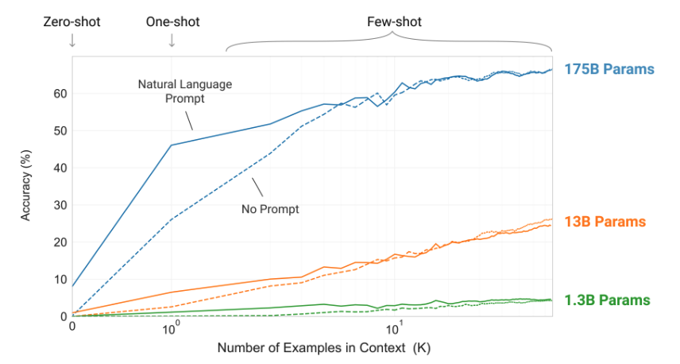
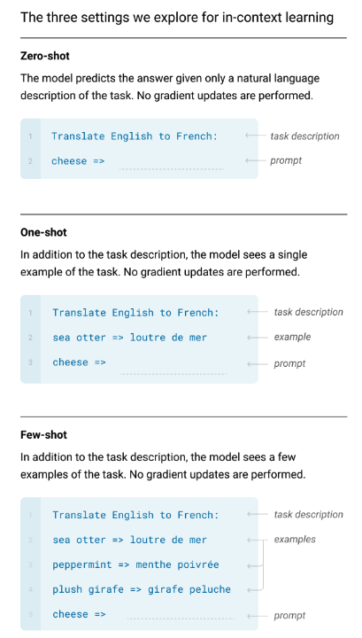

======================================================================
LLMの知識で使い倒すCopilot
======================================================================

:Event: VS Code Meetup #32 LT
:Presented: 2024/11/08 nikkie

📣 みなさーん！ GitHub Copilot、使ってますかー？？
======================================================================

私「いかにCopilotにコードを書かせるか、それだけを考えている」
----------------------------------------------------------------------

* Copilotに馬車馬のように働いてもらうために、私はLLMについての知識を使う
* 本LTのスコープは `Inline suggestions <https://code.visualstudio.com/docs/copilot/ai-powered-suggestions#_inline-suggestions>`__ です

お前、誰よ（自己紹介）
======================================================================

* nikkie（にっきー）
* 4月のVS Code Conference JPぶりですね
* `VS Codeで文字列のちょっとした変換ができるんです！ 〜実装まで覗くクイックツアー〜 <https://ftnext.github.io/2024-slides/vscodeconjp/transform-text-commands.html#/1>`__

仕事でもCopilot！
--------------------------------------------------

* 機械学習エンジニア・ **自然言語処理** （`We're hiring! <https://hrmos.co/pages/uzabase/jobs/1829077236709650481>`__）
* Copilot、お世話になっています！（`経済情報領域におけるChatGPT・LLM活用推進プロジェクト <https://www.uzabase.com/jp/info/20230428-play-engineering/>`__）

.. image:: ../_static/uzabase-white-logo.png

プライベートでもCopilot！
--------------------------------------------------

* :fab:`github` `@ftnext <https://github.com/ftnext>`__
* `Uberi/speech_recognition <https://github.com/Uberi/speech_recognition>`__ 8.4k⭐️ **メンテナ** （無料提供によるサポート、ありがとうございます）
* 🏃‍♂️他にこのスライドで使っている `sphinx-new-tab-link <https://pypi.org/project/sphinx-new-tab-link/>`__ など

Copilotが精度よく続きを書くとき（※私の感覚）
======================================================================

* *再掲：Inline suggestionsのお話*
* 空に近いファイルではなく、**ある程度書かれている** ファイル
* 仮説：Copilotが参考にできるコードが多いとき

自然言語処理からの裏付け
--------------------------------------------------

* 再掲 *参考にできるコードが多いとき、Copilotは精度よく生成*
* 実は、**例示が多い** とき、LLMは **精度が良くなる** と一般化できる
* キーワードは *few-shot*

GitHub Copilotの裏は、OpenAIのGPT
======================================================================

    The first public version of Copilot was launched using Codex, an early version of OpenAI GPT-3, specifically fine-tuned for coding tasks.

`Bringing developer choice to Copilot with Anthropic’s Claude 3.5 Sonnet, Google’s Gemini 1.5 Pro, and OpenAI’s o1-preview <https://github.blog/news-insights/product-news/bringing-developer-choice-to-copilot/>`_

GitHub Copilotの裏は、OpenAIのGPT（承前）🏃‍♂️
--------------------------------------------------

    we have updated the base model versions multiple times, using a range from GPT 3.5-turbo to GPT 4o and 4o-mini models

`Bringing developer choice to Copilot with Anthropic’s Claude 3.5 Sonnet, Google’s Gemini 1.5 Pro, and OpenAI’s o1-preview`_

ChatGPT（＝GPT-3.5）は、いきなり出てきたわけではない
------------------------------------------------------------

* `2018年 GPT <https://openai.com/index/language-unsupervised/>`__
* `2019年 GPT-2 <https://openai.com/index/better-language-models/>`__
* 2020年 GPT-3

GPT-3論文「Language Models are Few-Shot Learners」
------------------------------------------------------------

* 訳してみると「*言語モデルは少数の例示から学習する*」
* https://arxiv.org/abs/2005.14165

GPT-3のプロンプト
--------------------------------------------------

* **自然言語** で書けばよい
* 続きの生成を *促す*

.. code-block::
    :caption: GPT-3論文 Figure 2.1 より

    Translate English to French:
    cheese => 

GPT-3のここがすごい！
--------------------------------------------------

* 自然言語の **プロンプトを変えるだけ** で、1つのモデルで様々なタスクが解ける

    * コード生成、翻訳、etc.etc.

* 🏃‍♂️後の世代（ChatGPT以降）は、加えて会話形式で生成、かつ、有害なことを言わないように追加訓練をしています

few-shot プロンプト
--------------------------------------------------

* **例示** （shot） **をいくつも見せ** た上で続きの生成を促す

.. code-block::
    :caption: GPT-3論文 Figure 2.1 より

    Translate English to French:
    sea otter => loutre de mer
    peppermint => menthe poivrée
    plush girafe => girafe peluche
    cheese => 

パラメタ数が多いモデルほど、例を見せるほど正答率向上
------------------------------------------------------------

GPT-3論文 Figure 1.2

脱線🏃‍♂️ なぜ例示すると性能が上がるかは、まだ説明できていないらしいです
--------------------------------------------------------------------------------

* 例を見せる＝In-Context Learning (ICL) と呼ぶ（GPT-3論文より）
* なんと **例が間違っていても性能が上がる** ことが分かっている！（`Rethinking the Role of Demonstrations: What Makes In-Context Learning Work? <https://arxiv.org/abs/2202.12837>`__）
* ICLの説明はいくつか仮説が出てきているが、研究者間でまだ合意できていないらしい

GitHub Copilotとfew-shotプロンプト
======================================================================

* 参考にできるコードが多いとき、Copilotは精度よく生成する感覚を説明できていそう
* **すでに書いたコードがCopilotへの例示に** なっている！

よーし、テスト書くぞー！！（直近の例）
--------------------------------------------------

再掲 *いかにCopilotにコードを書かせるか*

.. code-block:: python
    :caption: 例：pytestを使ったPythonのテストコードのイメージ

    def test_  # からのファイルに最初のテストを書くとき、Copilotはやや見当違いな生成

テストケースを1つか2つ書いた後
--------------------------------------------------

.. code-block:: python

    def test_これこれのときはTrueを返す():
        # actualを特定の引数の組で作るコード
        assert actual is True

    def test_それそれのときはFalseを返す():
        # actualを上とは別の引数の組で作るコード
        assert actual is False

    def test_  # まだ網羅していない引数の組でコードを書いてくれる
        # assertのsuggestionの精度もよい

ただし、例に引っ張られる
--------------------------------------------------

.. 『テスト駆動Python 第2版』 2.3
    notの例 https://docs.pytest.org/en/stable/example/reportingdemo.html

.. code-block:: diff
    :caption: pytestとしてより良い書き換え

    -assert actual is True
    +assert actual

    -assert actual is False
    +assert not actual

* IMO：いまのCopilotは **ライブラリのベストプラクティスを提示するわけではない** （だから人間に知識が必要）

まとめ🌯：LLMの知識で使い倒すCopilot
======================================================================

* GPT-3論文で示された **few-shotを意識** して、Copilotの Inline suggestions を使っています
* 書き進めて例示豊富になったファイルでは、Tabで採用していくだけ
* 例を超える生成はまだできないので、ライブラリの **ベストプラクティスの知識は開発者に必要** と考えています

One more thing...
======================================================================

服部さん 今後の発表イベント
--------------------------------------------------

* `11/11(月) 明日の開発カンファレンス 2024 <https://fod.connpass.com/event/330797/>`__
* `11/13(水) コード×AI疑問解消会（Findyさん） <https://findy.connpass.com/event/333534/>`__
* 11/14(木) みんなのPython勉強会#110

11/14(木) みんなのPython勉強会#110
--------------------------------------------------

* 『コード×AI』本・PyCharmとAI
* **オンライン** 開催 https://startpython.connpass.com/event/334454/
* スタッフしています。よろしければ再びお会いしましょう！

ご清聴ありがとうございました
--------------------------------------------------

References・Appendixが続きます

References
======================================================================

* 『`大規模言語モデル入門 <https://gihyo.jp/book/2023/978-4-297-13633-8>`__』4.2.1
* `Few-Shotプロンプティング（Prompt Engineering Guide） <https://www.promptingguide.ai/jp/techniques/fewshot>`__
* `例を示す（GitHub Copilot のプロンプト エンジニアリング） <https://docs.github.com/ja/copilot/using-github-copilot/prompt-engineering-for-github-copilot#give-examples>`__
* 『`テスト駆動Python 第2版 <https://www.shoeisha.co.jp/book/detail/9784798177458>`__』2.3

`GPT-3論文 <https://arxiv.org/abs/2005.14165>`__ Figure 2.1 (left)
--------------------------------------------------------------------------------

Appendix
======================================================================

お前、誰よ（補足）
--------------------------------------------------

* 毎日 `ブログ <https://nikkie-ftnext.hatenablog.com/>`__ を書いてます。連続 **720** 日達成
* VS Code拡張 `TOKIMEKI Editing🌈 <https://marketplace.visualstudio.com/items?itemName=everlasting-diary.tokimeki-editing>`__

拙ブログ 関連記事
--------------------------------------------------

* `基本に立ち戻る：LLMのプロンプト <https://nikkie-ftnext.hatenablog.com/entry/llm-prompt-basics-202405-few-shot-learning-and-chain-of-thought>`__
* `そこにいるペアのCopilotを慮り、VS Codeのエディタに増えたタブを閉じる <https://nikkie-ftnext.hatenablog.com/entry/care-github-copilot-close-all-and-pin-editor-for-context>`__
* Copilotから学ぶ例： `grepの-oや正規表現の肯定先読み・肯定戻り読みで、テキストの一部だけを取り出す <https://nikkie-ftnext.hatenablog.com/entry/grep-only-matching-pcre-lookahead-lookbehind>`__

EOF
===
